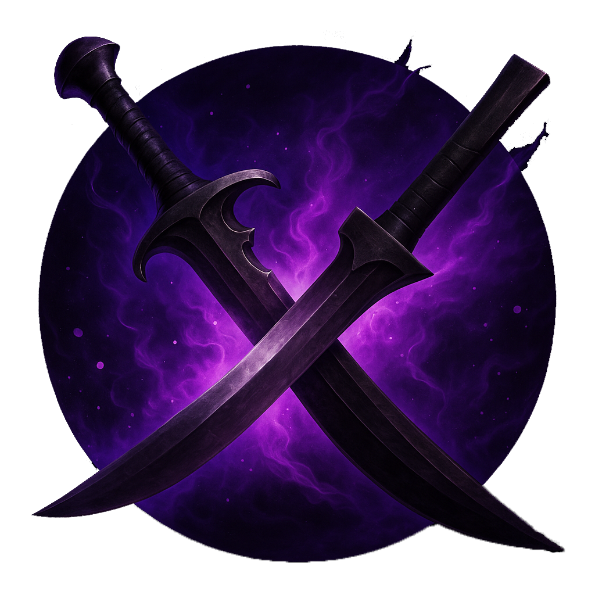

## Dota Stats

### How to clone repo
1. Install Node.js from official website, add it to PATH during install (usually done automatically, but check)
2. Check command `node -v` and `npm -v` in terminal
3. Clone this repo (for example, via https)
4. Open terminal, enter `packages/frontend` and do `npm install`
5. Then do `npm run dev` and if you see app on  http://localhost:5173 in browser, all good)

   
test Dima commit
test David commit
